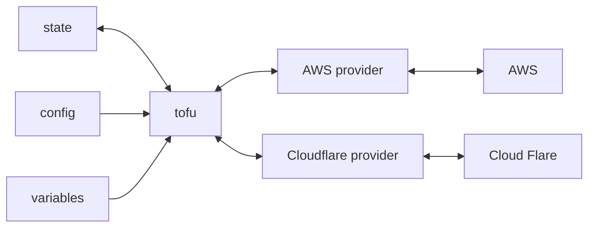

# presentation-iac-continued

 Infrastructure As Code (IAC) part deux

## Prerequisites

1. AWS account 
1. Laptop with the following tools installed

* [AWS cli](https://docs.aws.amazon.com/cli/latest/userguide/getting-started-install.html)
* [Git](https://git-scm.com/downloads)
* [OpenTofu](https://opentofu.org/docs/intro/install/)
* [Visual Studio Code (with WSL2 if running windows)](https://code.visualstudio.com/docs/setup/setup-overview)
* [cloud-nuke](https://github.com/gruntwork-io/cloud-nuke?tab=readme-ov-file#install)

# Overview

[Terraform](https://developer.hashicorp.com/terraform) became the industries most popular Infrastructure as code tool, the largest number of 3rd party providers. In 2023 Hashicorp, the owners of Terraform, changed the licence of all its products, this resulted in Terraform becoming a *source available* product no longer *open source*. This decision lead to a community fork of Terraform called [OpenTofu](https://opentofu.org/) 

Thankfully most of the most important 3rd party providers remain *open source*. This mean while there are two implementations of the core language
the providers remain largely compatible with both Terraform and OpenTofu.

Problem is over it is expected that these two projects will diverage enough that they will lose compatibity with one another. The author recommends
picking one tool, OpenTofu and sticking with it. 

## Articles

* [Hashicorp licence change announcment](https://www.hashicorp.com/en/blog/hashicorp-adopts-business-source-license)
* [Linux Foundation announcement of OpenTofu](https://www.linuxfoundation.org/press/announcing-opentofu)
* [Terraform versus OpenTofu](https://spacelift.io/blog/opentofu-vs-terraform)

# Basic usage

In Opentofu there are 4 basic commands you need to understand

```bash
tofu init
tofu plan
tofu apply
tofu destroy
```

And the following diagram tries to describe how the components of OpenTofu operate



## Providers + Init

Create a file called *main.tf* to hold your configuration (This is the a simple AWS demo)

```
% tree -a .
.
└── main.tf
```

With the following content

```bash
########################
# Provider configuration
########################

terraform {
  required_version = "= 1.9.1"
  
  required_providers {
    aws = {
      source  = "hashicorp/aws"
      version = "5.98.0"
    }
  }
}

provider "aws" {
  region = "eu-west-1"
}

####################
# Create resource(s)
####################

resource "aws_s3_bucket" "example" {
  bucket = "my-tf-test-bucket-20233"

  tags = {
    Name        = "My bucket"
  }
}

#######################
# Outputs configuration
#######################

output "name" {
  value = aws_s3_bucket.example.bucket
}

output "region" {
  value = aws_s3_bucket.example.region
}
```

Initialise

```bash
tofu init
```

Generates the following files

```
.
├── .terraform
│   └── providers
│       └── registry.opentofu.org
│           └── hashicorp
│               └── aws
│                   └── 5.98.0
│                       └── darwin_arm64
│                           ├── CHANGELOG.md
│                           ├── LICENSE
│                           ├── README.md
│                           └── terraform-provider-aws
├── .terraform.lock.hcl
└── main.tf
```

Hidden file explanation

* **.terraform.lock.hcl** : Detailed information on the dependencies downloaded 
* **.terraform** : This directory holds a copy of each downloaded provider dependency 

## State management

There are two kinds of state backend

1. Local Backend: The state file is stored within the working directory of the project
1. Remote Backend: The state file is stored in a remote object store (S3) or a managed service like Terraform Cloud

### Local state

```bash
tofu plan
tofu apply -auto-approve
```

Note a new file *terraform.tfstate* has been created.

```
.
├── .terraform
│   └── ..
├── ..
├── main.tf
└── terraform.tfstate
```

This file contains a list of the cloud resources created by OpenTofu

```bash
% tofu state list       
aws_s3_bucket.example
```

### Remote state

The documentation on supported backends is here

* https://opentofu.org/docs/language/settings/backends/configuration/

Let's enable and S3 backend to our example as follows:

```
terraform {
  required_version = "= 1.9.1"
  
  required_providers {
    aws = {
      source  = "hashicorp/aws"
      version = "5.98.0"
    }
  }

  backend "s3" {
    bucket  = "my-tf-test-bucket-backend-20233"
    key     = "state/terraform.tfstate"
    region  = "eu-west-1"
    encrypt = true
  }
}
```

Create the bucket

```bash
aws s3api create-bucket --bucket my-tf-test-bucket-backend-20233 --region eu-west-1  --create-bucket-configuration LocationConstraint=eu-west-1 --object-lock-enabled-for-bucket
```

Use the backend

```bash
#
#  Use the S3 backend
#
tofu init

#
# Plan+apply
#
tofu plan
tofu apply -auto-approve
```

Checkout the buckets via the UI

* https://eu-west-1.console.aws.amazon.com/s3/buckets?region=eu-west-1&bucketType=general

**NOTES:**

* This example purposely ignores state locking. We're going to assume only one person is going to be running OpenTofu

# Sample app walk-thru

The following is a more typical arrangment for OpenTofu code. The file names are not set in stone, OpenTofu will execute anything with a ```.tf``` extension.
It's a good idea for each team to adopt their own file naming convention, making the code more readable

```
modules
└── example
    ├── main.tf
    ├── outputs.tf
    ├── providers.tf
    └── variables.tf
```

Explore the code

* [modules/example/providers.tf](modules/example/providers.tf)
* [modules/example/variables.tf](modules/example/variables.tf)
* [modules/example/main.tf](modules/example/main.tf)
* [modules/example/outputs.tf](modules/example/outputs.tf)

## Run the sample

Create the remote backend

```bash
aws s3api create-bucket --bucket my-tf-test-bucket-backend-20233 --region eu-west-1  --create-bucket-configuration LocationConstraint=eu-west-1 --object-lock-enabled-for-bucket
```

Tofu

```bash
cd modules/example

tofu init
tofu plan
tofu apply -auto-approve
```

Check what was created

* [VPC console](https://eu-west-1.console.aws.amazon.com/vpcconsole/home?region=eu-west-1#vpcs:)
* [EC2 console](https://eu-west-1.console.aws.amazon.com/ec2/home?region=eu-west-1#Instances:)

## Use a Workspace to create another environment

OpenTofu has a mechanism called [workspaces](https://opentofu.org/docs/cli/workspaces/) to support using the same code to create multiple 
copies of the same infrastructure. 

**NOTE:** 

* Each workspace has a separate state within your remote backend.

```bash
#
# Check for existing workspaces
#
tofu workspace list

#
# Create a new workspace
#
tofu workspace new demo2

#
# Observe how everything is to be created (New environment)
#
tofu plan

#
# Plan+Apply overriding the VPC name variable
#
tofu plan -var vpc_name="IAC demo2" 
tofu plan -var vpc_name="IAC demo2" 
```

Check what was created

* [VPC console](https://eu-west-1.console.aws.amazon.com/vpcconsole/home?region=eu-west-1#vpcs:)
* [EC2 console](https://eu-west-1.console.aws.amazon.com/ec2/home?region=eu-west-1#Instances:)

# Additional

## Variables and outputs
## Code layout
## Modules

# Cleanup

Use [cloud-nuke](https://github.com/gruntwork-io/cloud-nuke) to purge cloud resources from the region

```bash
cloud-nuke aws --region eu-west-1 --exclude-resource-type ec2-subnet --exclude-resource-type internet-gateway
```

**NOTE:**

* Be very very careful you are not running this command on a production account